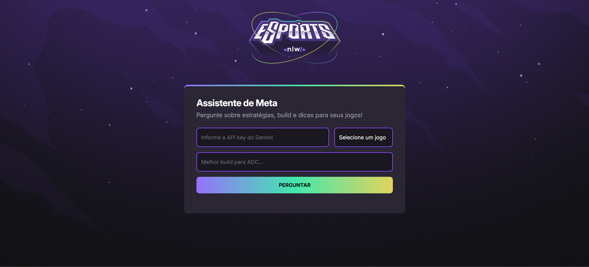

# 🎮 Assistente de Meta - NLW Rocketseat

Este projeto é um assistente de meta para jogos eletrônicos, desenvolvido durante o NLW da Rocketseat na trilha iniciante. O objetivo é fornecer respostas rápidas e atualizadas sobre estratégias, builds e dicas para jogos como Valorant, League of Legends e CS:GO, utilizando inteligência artificial.

## ✨ Funcionalidades

- 📝 Interface intuitiva para envio de perguntas sobre jogos.
- 🎯 Seleção do jogo desejado (Valorant, League of Legends, CS:GO).
- 🤖 Integração com a API do Gemini (Google) para geração de respostas via IA.
- 📄 Respostas em formato Markdown, convertidas automaticamente para HTML.
- ✅ Validação de campos e feedback visual durante o processamento da resposta.
- 📱 Layout responsivo e estilizado com animações e gradientes.

## 🛠️ Tecnologias Utilizadas

- **HTML5**: Estrutura da página.
- **CSS3**: Estilização, responsividade, animações e gradientes.
- **JavaScript (ES6+)**: Lógica de interação, integração com API, manipulação do DOM.
- **Showdown.js**: Conversão de respostas em Markdown para HTML.
- **API Gemini (Google Generative Language)**: Geração de respostas inteligentes e atualizadas.
- **Vercel**: Deploy do projeto em produção.

## 💡 Conceitos Aplicados

- Manipulação de DOM e eventos.
- Consumo de APIs externas com `fetch` e `async/await`.
- Engenharia de prompt para IA.
- Conversão dinâmica de Markdown para HTML.
- Validação de formulários e UX aprimorada.
- Boas práticas de organização de código e comentários explicativos.

## 🚀 Deploy

O projeto está disponível em produção no Vercel:  
[https://let-me-ask-ia-nlw-back-end.vercel.app/](https://let-me-ask-ia-nlw-back-end.vercel.app/)

---

Projeto desenvolvido com ❤️ durante o \*\*NLW da Rocketseat - Trilha
